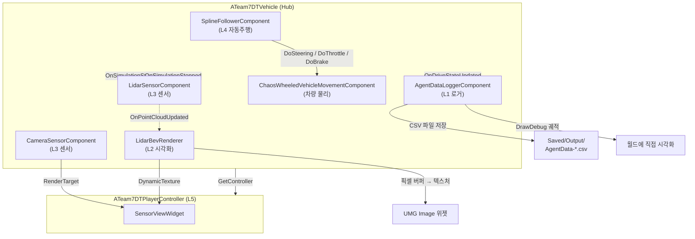
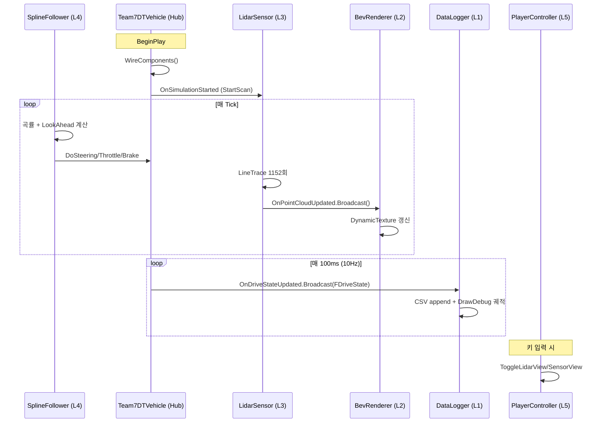

# 🏎️ Team7DT — 자율주행 디지털 트윈 시뮬레이터

> **Unreal Engine 5.5 C++** · **Chaos Vehicle** · **LiDAR / Camera 센서 시뮬레이션** · **BEV 시각화** · **자율 주행 + 주행 데이터 로깅**

스파르타 스킬업 프로젝트 — 7조  
2주간 5명이 5개 레이어로 분업하여 완성한 자율주행 디지털 트윈 시뮬레이터

---

## 🎬 시연 영상

> (https://youtu.be/P9ZdJjwxMa0)

브랜치 구조:
```
main
├── develop
├── feature/0429/sensor          (L3 — 센서)
├── feature/0430/Bev             (L2 — BEV 시각화)
├── feature/0430/auto-drive-tuning  (L4 — 자동주행)
└── feature/0506/integration     (L5 — 통합)
```

---

## 👥 팀 구성 (5명, 5개 레이어)

| 레이어 | 담당 | 결과물 |
|--------|------|-------|
| **L1** | 주행 데이터 로깅 | CSV 저장, UTM 좌표 변환, 트래젝토리 시각화 |
| **L2** | BEV 시각화 | DynamicTexture, 그리드, 차량 방향 화살표, Z값 색상 |
| **L3** | 센서 (LiDAR / Camera) | LineTrace 16채널, SceneCapture 프리셋 2종 |
| **L4** | 자동 주행 튜닝 | SplineFollower 파라미터 튜닝, ChaosVehicle 세팅 |
| **L5** | 시스템 통합 | Hub Pawn, 델리게이트 인터페이스, Git 머지 주도 |

---

## 🏗️ 시스템 아키텍처

### 컴포넌트 관계도



### 데이터 흐름 (시퀀스)



---

## 🎯 핵심 기능

### 1. 자율 주행 (L4)
- **Catmull-Rom 보간**으로 부드러운 경로 추종
- **곡률 기반 속도 제어** (원심력 한계 속도 자동 산출)
- **Look-Ahead 조향** (속도/곡률 비례 전방 주시)
- **튜닝 결과:** 초기 54.83초 → **최종 39.22초 (-15.61초, 28% 단축)**

### 2. LiDAR 센서 (L3)
- 16채널 elevation 배열 (-15° ~ +15°)
- 5° 간격 수평 회전 = **1,152 rays/Tick**
- LineTrace 기반 포인트 수집
- 노이즈 시뮬레이션

### 3. BEV 시각화 (L2)
- DynamicTexture 기반 실시간 렌더링
- **10m 간격 그리드** 오버레이
- **차량 방향 화살표** (노란 삼각형)
- **Z값 기반 색상 매핑** (높이별 그라데이션)

### 4. 카메라 센서 (L3)
- SceneCaptureComponent2D 기반
- 2종 프리셋: **Wide 120° FOV**, **Tele 30° FOV**
- 렌즈 왜곡(K1) 시뮬레이션
- UMG 위젯에 실시간 전송

### 5. 데이터 로거 (L1)
- **10Hz CSV 저장** (UTM 좌표 변환 포함)
- **속도별 트래젝토리** 색상 (파랑 → 빨강)
- **급감속 지점** Magenta 점 표시
- **5m 간격** 속도/Yaw 텍스트 오버레이

---

## 📊 주행 데이터 (CSV)

### 출력 형식 (13개 컬럼)
```
Timestamp, World_X, World_Y, World_Z, UTM_Easting, UTM_Northing, UTM_Zone,
Velocity_kmh, Yaw, Throttle, Steering, Brake, Acceleration_kmh_per_s
```

### 샘플 데이터 (한 바퀴 주행)
| Time(s) | UTM_E (m) | UTM_N (m) | Speed (km/h) | Yaw (°) | Throttle | Steering | Brake | Accel |
|---------|-----------|-----------|--------------|---------|----------|----------|-------|-------|
| 0.408   | 320797.76 | 4039142.51 | 1.47        | 0.00    | 1.000    | 0.092    | 0.000 | 0.00  |
| ...     | ...       | ...        | ...         | ...     | ...      | ...      | ...   | ...   |
| 77.512  | 320935.22 | 4039005.17 | 77.41       | 89.74   | 0.155    | 0.287    | 0.000 | -0.50 |

> WGS-84 UTM Zone 52 기준 (한국)

---

## 🏆 L4 튜닝 실험 결과

베이스 랩타임에서 **15.61초 단축** 달성

| 단계 | 주요 변경 | 랩타임 |
|------|----------|--------|
| 초기  | 기본 세팅 | 54.83초 |
| ch1  | LookAheadBase 1200 + MaxYawDelta 21 | 51.28초 |
| ch4  | LateralFriction 1.0 | 47.44초 |
| ch5  | LateralFriction 2.0, RWD | 39.94초 |
| ch6  | AWD | 39.85초 |
| **ch9** | **MaxYawDelta 17 + FWD** | **39.22초 ⭐ 최고 기록** |

### 최종 확정 파라미터

**SplineFollower**
- LookAheadBase: `1200`
- LookAheadSpeedFactor: `0.4`
- MaxYawDelta: `17.0`
- LateralFriction: `2.0`

**Chaos Vehicle**
- Differential Type: `Front Wheel Drive (FWD)`

> 자세한 튜닝 로그는 [`테스트결과.md`](./테스트결과.md) 참조

---

## 🛠️ 기술 스택

| 분류 | 기술 |
|------|------|
| **엔진** | Unreal Engine 5.5 |
| **언어** | C++17 |
| **차량 물리** | Chaos Vehicle |
| **센서 트레이스** | LineTraceByChannel |
| **카메라 캡처** | SceneCaptureComponent2D |
| **입력** | Enhanced Input |
| **좌표 변환** | UTM (WGS-84) |
| **데이터 저장** | CSV (FFileHelper) |

---

## 📁 프로젝트 구조

```
Source/Team7DT/
├── Public/
│   ├── Component/SplineFollowerComponent.h
│   ├── DataVisual/Team7DTAgentDataLoggerComponent.h
│   ├── Sensor/
│   │   ├── SensorTypes.h           ← 공유 타입
│   │   ├── LidarSensorComponent.h
│   │   ├── LidarBevRenderer.h
│   │   ├── CameraSensorComponent.h
│   │   └── SensorViewWidget.h
│   ├── DriveTypes.h                ← 공유 타입
│   ├── Team7DTVehicle.h            ← Hub
│   └── Team7DTPlayerController.h
└── Private/ (대응 .cpp)
```

---

## 🚀 빌드 & 실행

### 요구 사항
- Unreal Engine 5.5+
- Visual Studio 2022 또는 JetBrains Rider
- Windows 10/11 64-bit

### 실행 순서
```bash
1. Repository 클론
   git clone <repository-url>

2. .uproject 우클릭 → Generate Visual Studio project files

3. IDE에서 빌드 (Ctrl + B)

4. UE Editor 실행 → VehicleAdvExampleMap 열기

5. PIE 실행 (Alt + P)
```

### 키 매핑
| 키 | 동작 |
|------|------|
| `T` | Camera 센서뷰 토글 |
| `L` | LiDAR BEV 토글 |
| `V` | Front/Back 카메라 전환 |
| `R` | 차량 리셋 |

---

## 🎨 디자인 결정 근거

### 왜 델리게이트 패턴인가?
발제 요구사항: *"레이어 5는 델리게이트 인터페이스를 1주차에 픽스"*

- 컴포넌트 간 직접 참조 제거 → **느슨한 결합**
- Hub Pawn이 `WireComponents()`에서 한 번에 wiring
- 추후 구독자 추가 용이

### 왜 타입 헤더를 분리했나?
- 순환 참조 방지
- 공통 타입(`FLidarPointCloudData`, `FDriveState`)을 별도 헤더로
- 양쪽이 동등 의존하는 구조

---

## 📎 첨부 문서

| 문서 | 레이어 | 내용 |
|------|--------|------|
| [`ARCHITECTURE.md`](./ARCHITECTURE.md) | L5 | 시스템 아키텍처 + Mermaid 다이어그램 |
| [`테스트결과.md`](./테스트결과.md) | **L4** | 자동주행 튜닝 실험 보고서 (랩타임 39.22초 달성) |
| [`docs/AgentData-Sample.csv`](./docs/AgentData-Sample.csv) | **L1** | 주행 데이터 샘플 (108초, 1080행) |
| [`docs/L1_DataAnalysisReport.md`](./docs/L1_DataAnalysisReport.md) | **L1** | 주행 데이터 분석 리포트 |
